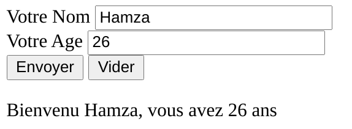
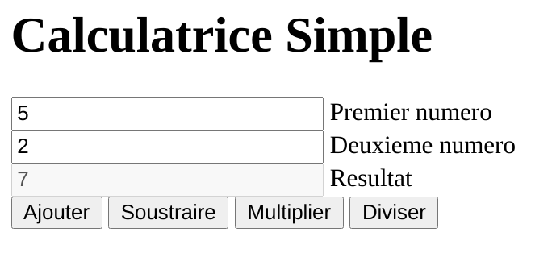
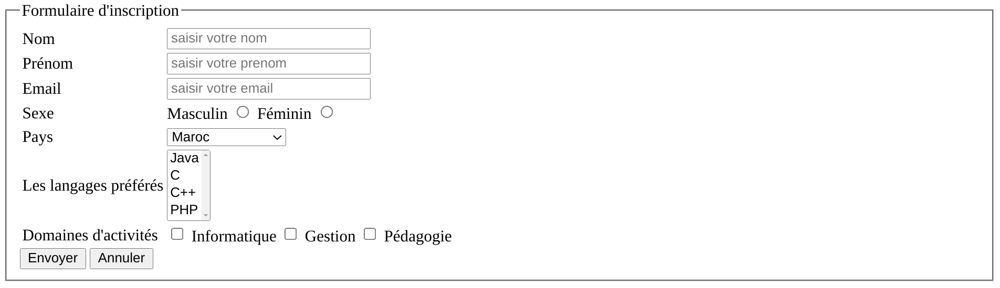
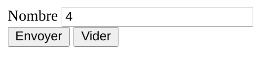
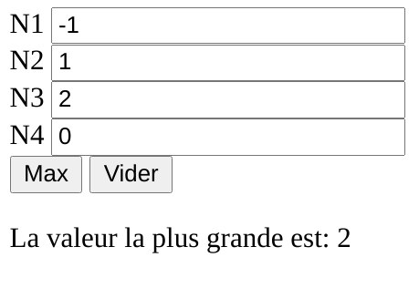

# Exercice 1
Écrire un page dynamique qui permet d'afficher le formulaire suivant:

Le bouton **Envoyer** de ce formulaire provoquera l'affichage d'une page qui saluera l'utilisateur avec cette phrase : **Bienvenu ........, vous avez ..... ans**.
Le bouton **Vider** videra les champs et effacera le message de salutation.

# Exercice 2
Écrire un programme de calcul simple en PHP en utilisant **switch-case** qui permet de réaliser les opérations suivantes:
- Addition
- Soustraction
- Multiplication
- Division

Gérer le cas de la division par 0.

# Exercice 3
Écrire le formulaire d'inscription suivant en PHP:

Vous devez:
1. Mettre les champs **Nom**, **Prénom**, **Email**, et **Sexe** des **champs obligatoires**.

2. **Valider** les valeurs des champs **Nom** et **Prénom** à l'aide des **expressions régulières** et la valeur du champ **Email** par la fonction **filter_var()**.

3. Assurer que l'utilisateur a choisit **juste les options données** pour les champs: **Sexe**, **Pays**, **Les langages préférés**, et **Domaines d'activités**. Par exemple, on ne doit pas accepter un langage different de (Java, C, C++, PHP).

# Exercice 4
Réaliser une application qui prend un **nombre positif** (**premier formulaire**) soit n, et qui **génère dynamiquement n champs** (**deuxième formulaire**) à utiliser pour chercher la **valeur la plus grande** des n valeurs entrées.

1. Premier formulaire:

2. Deuxième formulaire:

