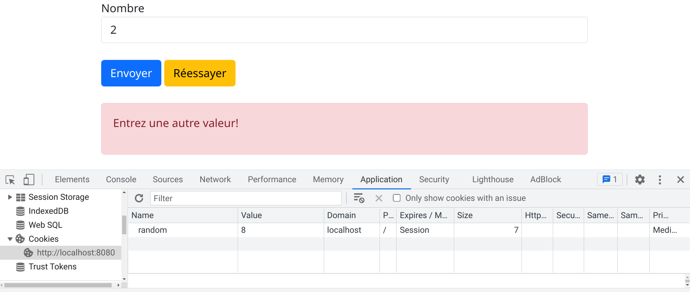
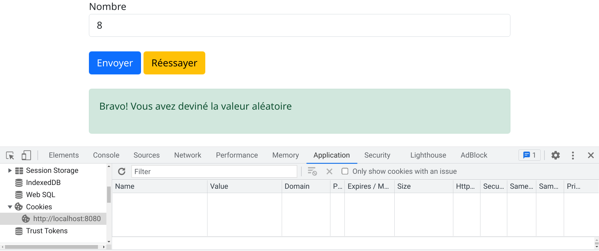
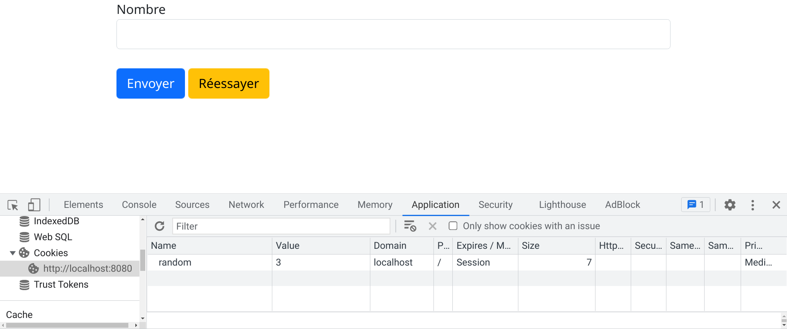

# Exercice 1
Réaliser une application pour **deviner** un **nombre aléatoire**.

1. Générer un nombre aléatoire entre **0 et 10** à l'aide de la fonction **rand()**, et enregister sa valeur comme **un cookie**.

2. Demander à l'utilisateur de deviner le nombre aléatoire et cliquer sur **Envoyer**, et **afficher un message**.

3. L'utilisateur peut **jouer à nouveau** en cliquant sur **Réessayer**.

