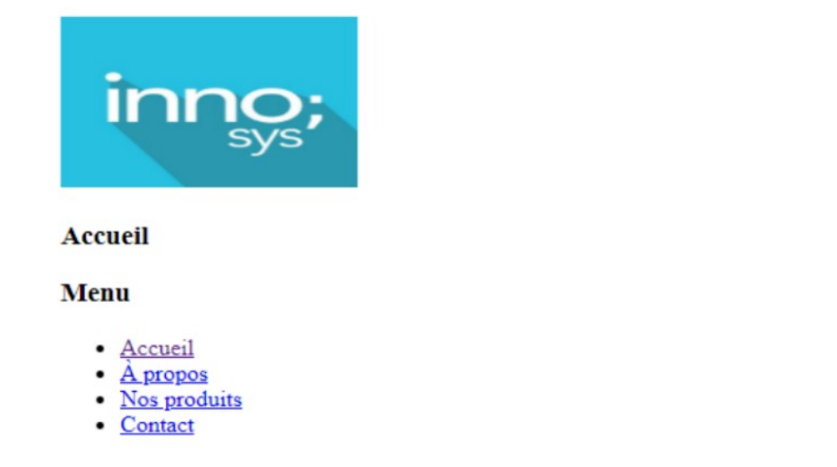
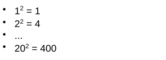

# Exercice 1
Écrivez la page **index.php** qui affiche la page ci-dessous en utilisant des **variables** et un **tableau associatif** pour le menu.

# Exercice 2
Écrivez un programme qui **initialise** trois valeurs entières (**a, b et c**) et qui affiche la **plus grande** des trois valeurs, en utilisant **if - else** et une
variable d'aide **max**.

# Exercice 3
Écrivez une page PHP pour afficher les **messages** et les **salaires** dans une **table html** en utilisant un **tableau associatif**.

# Exercice 4
1. Créez une page php qui affiche simplement la chaîne de caractères **"Hello PHP, nous sommes le "** suivie de la **date du jour** sur le serveur.
2. Créez une deuxième version permettant d'afficher à la suite de la date, le message **"Bon matin"** ou **"Bonne après midi" en fonction de l'heure** sur le serveur.

- **_date("d-m-Y")_** : retourne le jour, le mois et l'année sur le serveur.
- **_date("H")_** : retourne l'heure sur le serveur.

# Exercice 5
Créer une page PHP permettant d'afficher, sous forme de **liste non ordonnée**, les **carrés** des nombres **de 1 à 20** selon le format:

# Exercice 6
Créez un script PHP qui affiche **1-2-3-...-30** (de 1 jusqu'à 30) sur une ligne. Il n'y aura pas de trait d'union (-) aux positions de départ et d'arrivée.

# Exercice 7
Ecrivez un script PHP qui crée le tableau suivant en utilisant des **boucles _for_**. Ajoutez **_border = "1px"_**, **_cellpadding = "3px"_** et **_cellspacing = "0px"_** à la balise **table**:

